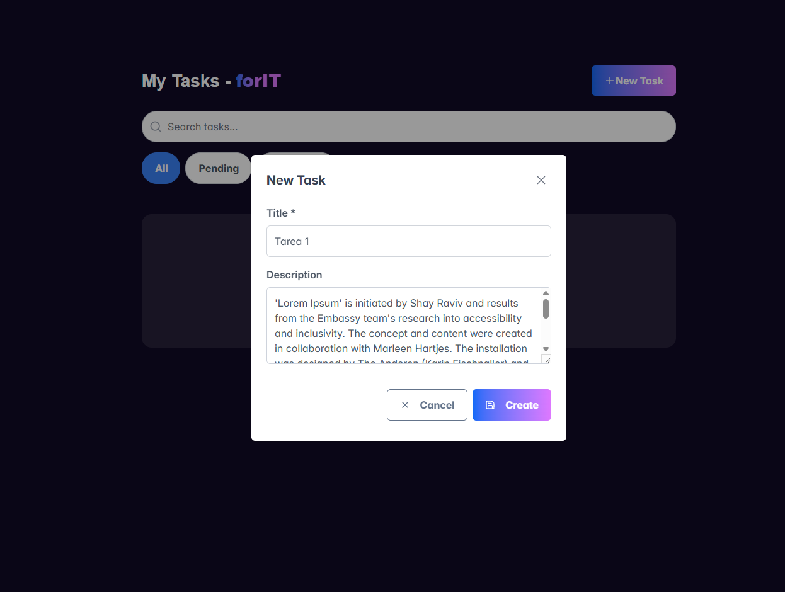
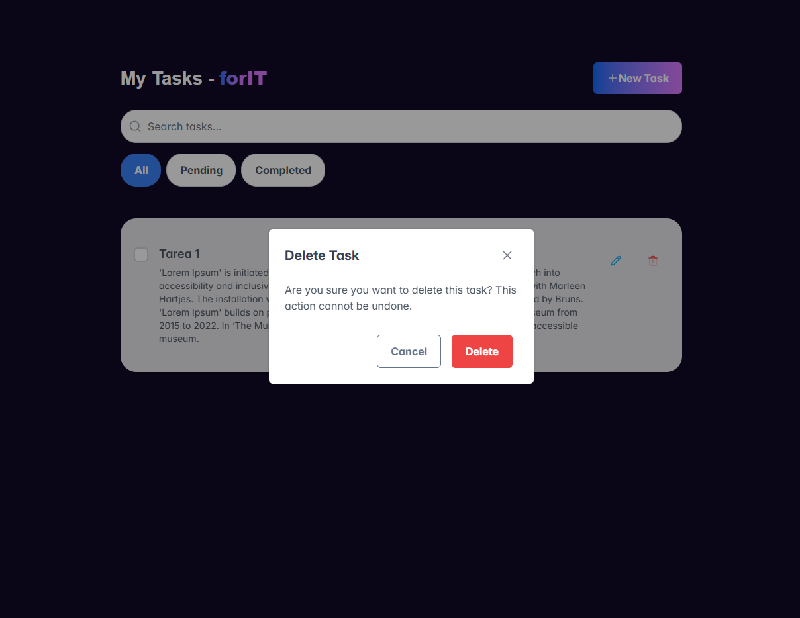
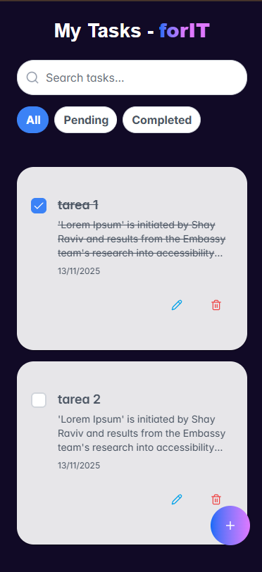
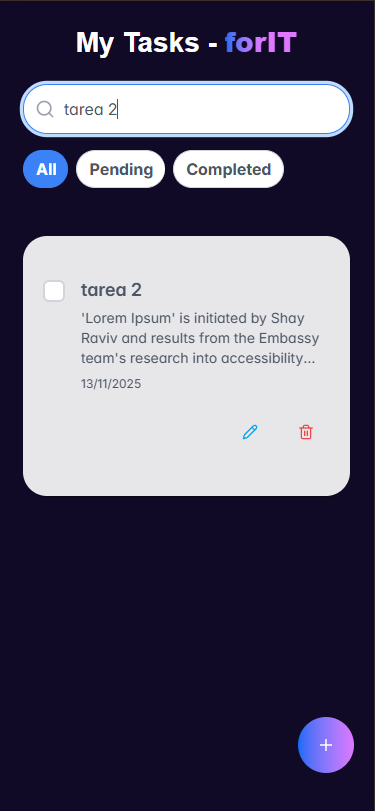

# Task Manager - Next.js + TypeScript + PrimeReact

Una aplicación completa de gestión de tareas construida con Next.js, TypeScript, PrimeReact, Zustand, y SQLite.

## 🚀 Características

- ✅ **CRUD completo** de tareas (Crear, Leer, Actualizar, Eliminar)
- 🎨 **UI moderna** con PrimeReact y Tailwind CSS
- 📱 **Responsive** y adaptable a móviles
- 🔍 **Búsqueda** en tiempo real
- 🎯 **Filtros** por estado (Todas, Pendientes, Completadas)
- ✨ **Validación de formularios** con Zod y React Hook Form
- 💾 **Persistencia** con SQLite (better-sqlite3)
- 🎭 **Gestión de estado** con Zustand
- 🎪 **Iconos** con Lucide React
- 📝 **TypeScript** para type safety

## 🛠️ Tecnologías

### Frontend
- **Next.js 16** (App Router)
- **React 19**
- **TypeScript**
- **PrimeReact** - Componentes UI
- **Tailwind CSS** - Estilos
- **Zustand** - State Management
- **React Hook Form** - Manejo de formularios
- **Zod** - Validación de esquemas
- **Lucide React** - Iconos

### Backend
- **Next.js API Routes** - REST API
- **better-sqlite3** - Base de datos SQLite

## 📋 Requisitos Previos

- Node.js 18+ 
- pnpm, npm, o yarn

## 🔧 Instalación

1. Clona el repositorio:
```bash
git clone <tu-repo-url>
cd next-tasks
```

2. Instala las dependencias:
```bash
pnpm install
# o
npm install
```

3. Crea el archivo de variables de entorno:
```bash
# En Windows (PowerShell)
Copy-Item .env.local.example .env.local

# En Linux/Mac
cp .env.local.example .env.local
```

4. (Opcional) Configura las variables de entorno en `.env.local`:
```env
DATABASE_FILE=./data.db
NEXT_PUBLIC_API_URL=
```

## 🚀 Ejecución Local

### Modo Desarrollo

1. Inicia el servidor de desarrollo:
```bash
pnpm dev
# o
npm run dev
```

2. Abre tu navegador en [http://localhost:3000](http://localhost:3000)

3. La aplicación se recargará automáticamente cuando hagas cambios en el código

4. La base de datos SQLite (`data.db`) se creará automáticamente en la raíz del proyecto al hacer la primera petición a la API

### Modo Producción

1. Construye la aplicación optimizada:
```bash
pnpm build
# o
npm run build
```

2. Inicia el servidor de producción:
```bash
pnpm start
# o
npm start
```

3. La aplicación estará disponible en [http://localhost:3000](http://localhost:3000)

### Comandos Útiles

```bash
# Limpiar caché de Next.js
rm -rf .next

# Limpiar node_modules y reinstalar
rm -rf node_modules
pnpm install

# Ejecutar linter
pnpm lint
# o
npm run lint

# Ver la base de datos (requiere sqlite3 CLI)
sqlite3 data.db "SELECT * FROM tasks;"
```

## 📁 Estructura del Proyecto

```
next-tasks/
├── src/
│   ├── app/
│   │   ├── api/
│   │   │   └── tasks/
│   │   │       ├── route.ts          # GET, POST /api/tasks
│   │   │       └── [id]/route.ts     # PUT, DELETE /api/tasks/:id
│   │   ├── layout.tsx                # Layout con PrimeReact CSS
│   │   ├── page.tsx                  # Página principal
│   │   └── globals.css               # Estilos globales
│   ├── components/
│   │   ├── TaskList.tsx              # Lista con filtros y búsqueda
│   │   ├── TaskItem.tsx              # Item individual
│   │   └── TaskForm.tsx              # Formulario crear/editar
│   ├── lib/
│   │   └── db.ts                     # Acceso a SQLite
│   └── store/
│       └── taskStore.ts              # Store Zustand
├── .env.local.example                # Ejemplo de variables
└── package.json
```

## 🎯 API Endpoints

- `GET /api/tasks` - Obtener todas las tareas
- `POST /api/tasks` - Crear tarea
- `PUT /api/tasks/:id` - Actualizar tarea
- `DELETE /api/tasks/:id` - Eliminar tarea

## 📝 Variables de Entorno

```env
DATABASE_FILE=./data.db
NEXT_PUBLIC_API_URL=
```

## 📷 Capturas de pantalla











## 👨‍💻 Autor

Dante Lugo

